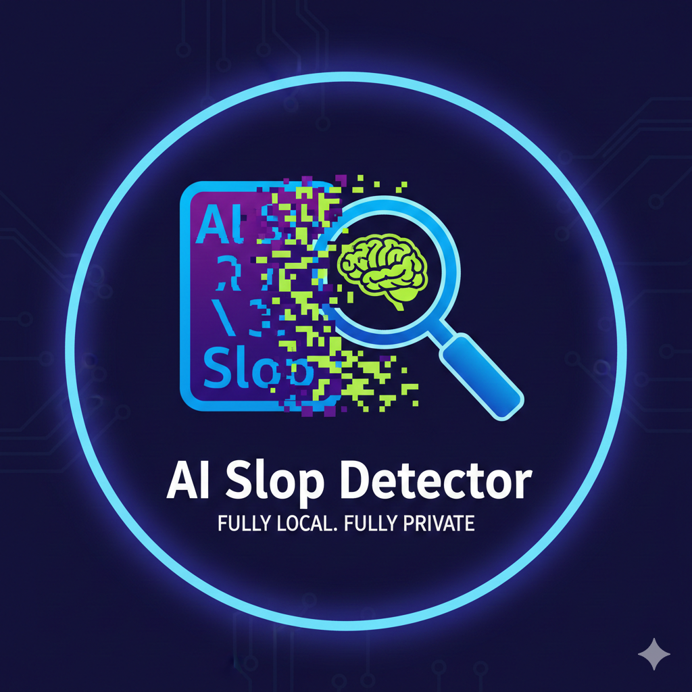
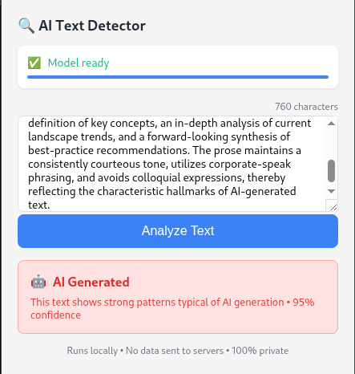
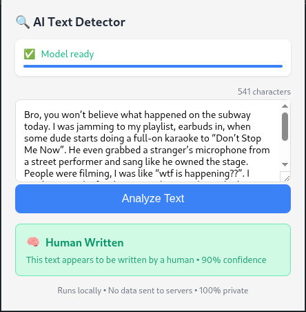

# AI Slop Detector 🔍: **Catch AI-generated text with a 270M model that runs in your browser**

<p align="center">
  
</p>


*Slop happens. Now you can spot it - without sending your text anywhere.*

We fine-tuned a tiny language model to detect AI-generated text. Because it's small (270M parameters, quantized to 242 MB), you can run it **entirely in your browser** - no API keys, no cloud dependencies, no data leakage. Your text never leaves your machine.

## Results

| Model | Parameters | Test Accuracy | Precision | Model Link |
| --- | --- | --- | --- | --- |
| GPT OSS 120B (teacher) | ~120B | 100% | 100% | |
| **Gemma 3 270M (tuned)** | **270M** | **100%** | **100%** | [HuggingFace](https://huggingface.co/distil-labs/distil-ai-slop-detector-gemma) |
| Gemma 3 270M Q4 (quantized) | 270M | ~95% | ~95% | |
| Gemma 3 270M (base) | 270M | ~40% | ~55% | |

The tuned model **matches the 120B teacher** while being **over 400x smaller** - and the quantized version runs entirely in a browser extension at ~95% accuracy.

## Quick Start

### 1. Download the extension

[Download this repo as ZIP](https://github.com/distil-labs/distil-ai-slop-detector/archive/refs/heads/main.zip) (or click "Code" -> "Download ZIP" on GitHub)

Unzip the downloaded file. You should have a folder called `distil-ai-slop-detector-main`.

### 2. Load in Chrome

1. Open `chrome://extensions/`
2. Enable **Developer mode** (toggle in top-right)
3. Click **Load unpacked**
4. Select the `distil-ai-slop-detector-main` folder you just unzipped

### 3. Use it

1. Click the 🔍 icon in your toolbar
2. Wait for model download (~253 MB, cached after first use)
3. Paste text and click **Analyze**

That's it. The model runs locally via [Wllama](https://github.com/niconielsen32/wllama) on CPU. **No data ever leaves your machine.**

<p align="center">
  
  
</p>

<p align="center">
  <sub>Left: AI-generated text · Right: Human-written text</sub>
</p>

## How We Trained AI Slop Detector

### The Problem

AI-generated "slop" is flooding the internet. You've seen it: the generic LinkedIn posts, the suspiciously polished product reviews, the Reddit comments that hit every corporate communication checkbox.

Existing detectors either require API calls (privacy concern) or run models too large for local deployment. We needed something that:

* **Runs locally:** no API calls, works offline, keeps your data private
* **Fits in a browser:** small enough to load in a Chrome extension
* **Stays accurate:** matches large model performance on the detection task

### Validating the Base Model Fails

We tested Gemma 3 270M out of the box on our test set.

The base model achieved **~40% accuracy** - essentially random guessing. Common failure modes:

* Classifying formal human writing as AI-generated
* Missing obvious AI markers ("delve into", "it's worth noting")
* Inconsistent outputs across similar inputs

This confirmed the task is learnable but not already learned. A perfect candidate for fine-tuning.

### Establishing a Teacher Baseline

We tested GPT OSS 120B with a system prompt explaining the task and few-shot examples.

The 120B model achieved **100% accuracy** on our test set. This became our target - could we match it with a model 400x smaller?

### Defining the Task Format

```json
{
  "input": "lmao no way that actually worked 😂 you're a genius thanks so much!!!",
  "output": "human_written"
}
```

```json
{
  "input": "We recognize the value of your feedback and remain committed to continuous improvement. Your satisfaction is our top priority.",
  "output": "ai_generated"
}
```

The model outputs a single classification label: `ai_generated` or `human_written`.

### Creating the Training Pipeline

1. **Seed Data:** We wrote ~50 examples covering obvious AI markers, subtle corporate-speak, casual human text, and edge cases (formal human writing, edited AI output)

2. **Synthetic Expansion:** Using the [Distil Labs platform](https://distillabs.ai), we expanded to **~10,000 training examples** via knowledge distillation from the teacher model

3. **Fine-tuning:** We trained Gemma 3 270M using LoRA for 4 epochs

4. **Quantization:** We converted to Q4_K_M format for browser deployment (~242 MB)

### Results by Difficulty

| Difficulty | Description | Examples | Accuracy |
| --- | --- | --- | --- |
| Easy | Obvious AI markers | 6 | 100% (6/6) |
| Medium | Subtle differences | 8 | 100% (8/8) |
| Hard | Edge cases | 6 | 83% (5/6) |

**Overall: 95% (19/20)** on the extended test suite.

### Real-World Validation

We tested on content the model never saw during training:

| Content Type | Sample Size | Accuracy |
| --- | --- | --- |
| Reddit comments | 100+ | ~92% |
| ChatGPT outputs | 50 | 98% |
| Human tweets | 50 | 94% |
| Formal emails | 30 | 88% |

The model struggles most with formal human writing (emails, business documents) - these often trigger false positives because they share stylistic patterns with AI output.

### Quantization Impact

| Format | Size | Accuracy | Use Case |
| --- | --- | --- | --- |
| Full precision | ~1.1 GB | 100% | Server deployment |
| **Q4_K_M (quantized)** | **~242 MB** | **~95%** | **Browser extension** |

Size reduction: **~78%** with minimal accuracy loss. Inference speed: **~0.5-2 seconds** per query on consumer CPUs.

## Train Your Own Detector

The workflow we used is generic across classification tasks. You can train your own model by chatting with Claude using the Distil Labs skill.

### Install the Distil CLI

```bash
curl -fsSL https://cli-assets.distillabs.ai/install.sh | sh
distil login  # or distil signup if you're new
```

### Install the Claude Skill

[Download the skill repo as ZIP](https://github.com/distil-labs/distil-cli-skill/archive/refs/heads/main.zip) (or click "Code" -> "Download ZIP" on GitHub)

Unzip it and add it to your Claude Desktop or Claude Code. For Claude Code:

```bash
/plugin marketplace add https://github.com/distil-labs/distil-cli-skill
/plugin install distil-cli@distil-cli-skill
```

### Train a Model

With the skill installed, just describe what you need to Claude:

```
> Hey Claude, I want to train a classifier that detects AI-generated text.
> Here are some examples in my data/ folder. Can you help me train a model?
```

Claude will guide you through:

1. **Creating a model:** `distil model create my-detector`
2. **Preparing data files:** job_description.json, config.yaml, train.csv, test.csv
3. **Running teacher evaluation:** validates the task is learnable
4. **Training:** kicks off the distillation process
5. **Downloading:** gets the trained model to your machine

The full workflow takes a few hours (mostly waiting for training). You can see a complete example in [our Text2SQL tutorial](https://www.distillabs.ai/blog/train-your-slm-with-distil-claude-skill).

### Resources

* [Distil Labs Documentation](https://docs.distillabs.ai/)
* [Claude Skill on GitHub](https://github.com/distil-labs/distil-cli-skill)
* [CLI Reference](https://docs.distillabs.ai/getting-started/cli)

For custom training assistance, visit [distillabs.ai](https://www.distillabs.ai/).

## FAQ

**Q: How does the extension work?**

The repository is organized into two main parts: the browser extension code and the training data/configuration.

```
ai-slop-detector/
├── background.js        # Service worker for model coordination
├── manifest.json        # Chrome extension config
├── offscreen.html/js    # Isolated model execution context
├── popup.html/js        # Extension UI
├── wllama/              # WebAssembly runtime for inference
├── data/                # Training assets (not used at runtime)
│   ├── config.yaml
│   ├── job_description.json
│   ├── train.csv
│   └── test.csv
└── icons/               # Extension icons and demo images
```

**What runs where:**

* **Browser:** JavaScript + Wllama for fully local inference
* **Training (`/data/`):** Used to create the model via Distil Labs - not needed at runtime

---

**Q: Why not just use GPT-4 / Claude for this?**

Because your text shouldn't leave your machine. AI Slop Detector runs locally, works offline, and keeps everything private. No API costs, no rate limits, no data leakage.

---

**Q: Why not use the base Gemma model directly?**

The base model only achieves ~40% accuracy - essentially random guessing. Fine-tuning is essential to make it work.

---

**Q: Is my text sent anywhere?**

No. The model downloads once from HuggingFace (~253 MB), gets cached by your browser, and runs entirely locally. Your text **never leaves your machine**.

---

**Q: Why does first load take so long?**

The browser downloads and caches the model (~253 MB) on first use. After that, launches are near-instant.

---

**Q: Can I use this offline?**

Yes - that's the point.

* 100% offline after initial download
* Privacy-first - no data ever leaves your device
* Fast - ~0.5-2 seconds per query on consumer CPUs
* Free - no API costs or rate limits

---

**Q: The model flagged human text as AI-generated**

The model achieves ~95% accuracy after quantization, which means ~1 in 20 predictions may be wrong. Formal human writing (business emails, academic text) sometimes triggers false positives because it shares stylistic patterns with AI output.

If you find consistent errors, please open an issue.

---

**Q: Can you train a detector for my specific use case?**

Yes! Visit [distillabs.ai](https://www.distillabs.ai/) to discuss custom solutions.

## Links

[](https://www.distillabs.ai/)
[](https://docs.distillabs.ai/)
[](https://github.com/distil-labs)
[](https://huggingface.co/distil-labs)
[](https://www.linkedin.com/company/distil-labs/)
[](https://join.slack.com/t/distil-labs-community/shared_invite/zt-36zqj87le-i3quWUn2bjErRq22xoE58g)

---

*Built with [Distil Labs](https://distillabs.ai) - turn a prompt and a few examples into production-ready small language models.*


